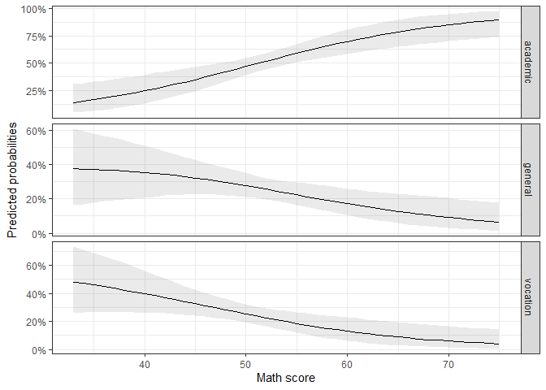
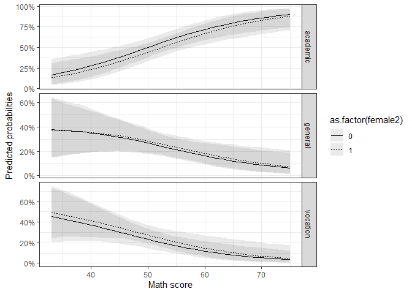
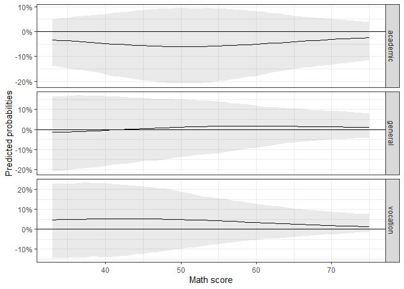

<!-- README.md is generated from README.Rmd. Please edit that file -->

This package provides functions that make it easy to get plottable
predictions from multinomial logit models. The predictions are based on
simulated draws of regression estimates from their respective sampling
distribution.

At first I will present the theoretical and statistical background,
before using sample data to demonstrate the functions of the package.

## The multinomial logit model

For the statistical and theoretical background of the multinomial logit
regression please refer to the vignette or sources like [these lecture
notes by Germán
Rodríguez](https://data.princeton.edu/wws509/notes/c6s2).

Due to the inconvenience of integrating math equations in the README
file, this is not the place to write comprehensively about it.

These are the important characteristics of the model: \* The multinomial
logit regression is used to model nominal outcomes. It provides the
opportunity to assign specific choices a probability based on a set of
independent variables. \* The model needs an assigned baseline category
to be indentifiable. All other choices are evaluated in contrast to this
reference. \* The model returns a set of coefficients for each choice
category. \* Like all logit models, the multinomial logit model returns
logg-ods which are difficult to interpret in terms of effect sizes and
uncertainties.

This package helps to interpret the model in meaningful ways.

## Using the package

### How does the function work?

As we have seen above, the multinomial logit can be used to get an
insight into the probabilities to choose one option out of a set of
alternatives. We have also seen that we need a baseline category to
identify the model. This is mathematically necessary, but does not come
in handy for purposes of interpretation.

It is far more helpful and easier to understand to come up with
predicted probabilities and first differences for values of interest
(see e.g., King, Tomz, and Wittenberg 2000 for approaches in social
sciences). Based on simulations, this package helps to easily predict
probabilities and confidence intervals for each choice category over a
specified scenario (so far: the observed values).

The procedure follows the following steps:

1.  Estimate a multinomial model and save the coefficients and the
    variance covariance matrix (based on the Hessian-matrix of the
    model).
2.  To simulate uncertainty, draw \(n\) times coefficients from a
    simulated sampling distribution based on the coefficients and the
    variance covariance matrix.
3.  Predict probabilities by multiplying the drawn coefficients with a
    specified scenario (so far these are the observed values).
4.  Take the mean and the quantiles of the simulated predicted
    probabilities.

The presented functions follow these steps. Additionally, they use (so
far) the so called observed value approach. This means as the
“scenario”, all the observed values are used that were informin the
model. Therefore the function takes these more detailed steps:

1.  For all (complete) cases \(n\) predictions are computed based on
    their observed independent values and the \(n\) sets of
    coefficients.
2.  Next the predicted values of all observation for each simulation are
    averaged.
3.  See step 4. above.

For so-called first differences, the simulated predictions are
subtracted from each other.

To showcase these steps, I present a reproducable example how the
functions can be used.

### Example

The example is based on this [UCLA R data analysis
example](https://stats.idre.ucla.edu/r/dae/multinomial-logistic-regression/).

The data is an example dataset, including the career choice of 200 high
school students and their respective performance indicators. We want to
predict the probability of the students to choose either an academic,
general, or vocational programm.

For this task, we need the following packages:

``` r
# Reading data
library(foreign)

# Required packages
library(magrittr) # for pipes
library(nnet) # for the multinom()-function
library(MASS) # for the multivariate normal distribution

# The package
# devtools::install_github("ManuelNeumann/MNLpred")
library(MNLpred)

# Plotting the predicted probabilities:
library(ggplot2)
library(scales)
```

Now we load the data:

``` r
# The data:
ml <- read.dta("https://stats.idre.ucla.edu/stat/data/hsbdemo.dta")
```

As we have seen above, we need a baseline or reference category for the
model to work. With the function `relevel()` we set the category
`"academic"` as the baseline. Additionally, we compute a numeric dummy
for the gender variable to include it in the model.

``` r
# Data preparation:

# Set "academic" as the reference category for the multinomial model
ml$prog2 <- relevel(ml$prog, ref = "academic")

# Computing a numeric dummy for "female" (= 1)
ml$female2 <- as.numeric(ml$female == "female")
```

The next step is to compute the actual model. The function of the
`MNLpred` package is based on models that were estimated with the
`multinom()`-function of the `nnet` package. The `multinom()` function
is convenient because it does not need transformed datasets. The syntax
is very easy and resembles the ordinary regression functions. Important
is that the Hessian matrix is returned with `Hess = TRUE`. The matrix is
needed to simulate the sampling distribution.

``` r
# Multinomial logit model:
mod1 <- multinom(prog2 ~ female2 + read + write + math + science,
                 Hess = TRUE,
                 data = ml)
#> # weights:  21 (12 variable)
#> initial  value 219.722458 
#> iter  10 value 189.686272
#> final  value 168.079235 
#> converged
```

The results show the coefficients and standard errors. As we can see,
there are two sets of coefficients. They describe the relationship
between the reference category and the choices `general` and `vocation`.

``` r
summary(mod1)
#> Call:
#> multinom(formula = prog2 ~ female2 + read + write + math + science, 
#>     data = ml, Hess = TRUE)
#> 
#> Coefficients:
#>          (Intercept)   female2        read       write        math
#> general     4.314585 0.2180419 -0.05466370 -0.03863058 -0.09931014
#> vocation    8.592285 0.3618313 -0.05535549 -0.07165604 -0.12226602
#>             science
#> general  0.09386869
#> vocation 0.06388337
#> 
#> Std. Errors:
#>          (Intercept)   female2       read      write       math    science
#> general     1.444954 0.4368366 0.02816753 0.03088249 0.03307516 0.03007196
#> vocation    1.553752 0.4595495 0.03060286 0.03142334 0.03598240 0.03020753
#> 
#> Residual Deviance: 336.1585 
#> AIC: 360.1585
```

A first rough review of the coefficients shows that higher math scores
lead to a lower probability of the students to choose a general or
vocational track. It is hard to evaluate whether the effect is
statistically significant and how the probabilities for each choice look
like. For this it is helpful to predict the probabilities for certain
scenarios and plot the means and confidence intervals for visual
analysis.

Let’s say we are interested in the relationship between the math scores
and the probability to choose one or the other type of track. It would
be helpful to plot the predicted probabilities for the span of the math
scores.

``` r
summary(ml$math)
#>    Min. 1st Qu.  Median    Mean 3rd Qu.    Max. 
#>   33.00   45.00   52.00   52.65   59.00   75.00
```

As we can see, the math scores range from 33 to 75. Let’s pick this
score as the x-variable (`xvari`) and use the `mnl_pred_ova()` function
to get predicted probabilities for each math score in this range.

The function needs a multinomial logit model (`model`), data (`data`),
the variable of interest `xvari`, the steps for which the probabilities
should be predicted (`by`). Additionally, a `seed` can be defined for
replication purposes, the numbers of simulations can be defined
(`nsim`), and the confidence intervals (`probs`).

(If we want to hold another variable stable, we can specify so with
`scennname`and `scenvalue`. See also the `mnl_fd_ova()` function below.)

``` r
pred1 <- mnl_pred_ova(model = mod1,
                      data = ml,
                      xvari = "math",
                      by = 1,
                      seed = "random", # default
                      nsim = 1000, # default
                      probs = c(0.025, 0.975)) # default
```

The function returns a list with several elements. Most importantly, it
returns a `plotdata` data set:

``` r
pred1$plotdata %>% head()
#> # A tibble: 6 x 5
#>    math prog2     mean  lower upper
#>   <dbl> <fct>    <dbl>  <dbl> <dbl>
#> 1    33 academic 0.148 0.0474 0.318
#> 2    34 academic 0.160 0.0554 0.331
#> 3    35 academic 0.173 0.0643 0.344
#> 4    36 academic 0.187 0.0750 0.357
#> 5    37 academic 0.202 0.0878 0.369
#> 6    38 academic 0.218 0.101  0.381
```

As we can see, it includes the range of the x variable, a mean, a lower,
and an upper bound of the confidence interval. Concerning the choice
category, the data is in a long format. This makes it easy to plot it
with the `ggplot` syntax. The choice category can now easily used to
differenciate the lines in the plot by using `linetype = prog2` in the
`aes()`. Another option is to use `facet_wrap()` or `facet_grid()` to
differenciate the predictions:

``` r
ggplot(data = pred1$plotdata, aes(x = math, y = mean,
                                  ymin = lower, ymax = upper)) +
  geom_ribbon(alpha = 0.1) + # Confidence intervals
  geom_line() + # Mean
  facet_grid(prog2 ~., scales = "free_y") +
  scale_y_continuous(labels = percent_format(accuracy = 1)) + # % labels
  theme_bw() +
  labs(y = "Predicted probabilities",
       x = "Math score") # Always label your axes ;)
```

<!-- -->

We are often not only interested in the progress of probability but in
the difference between scenarios. This is especially helpful when we
look at dummy variables. For example, we could be interested in the
effect of `female`. With the `mnl_fd_ova()` function, we can predict the
probabilities for two scenarios and subtract them. The function returns
the differences and the confidence intervals of the differences. The
different scenarios can be held stable with `scenname` and the
`scenvalues`. `scenvalues` takes a vector of two numeric values. These
values are held stable for the variable that is named in `scenname`.

``` r
fdif1 <- mnl_fd_ova(model = mod1,
                    data = ml,
                    xvari = "math",
                    by = 1,
                    scenname = "female2",
                    scenvalues = c(0,1))
```

As before, the function returns a list, including a data set that can be
used to plot the differences.

``` r
fdif1$plotdata %>% head()
#> # A tibble: 6 x 5
#>    math prog2       mean  lower  upper
#>   <dbl> <fct>      <dbl>  <dbl>  <dbl>
#> 1    33 academic -0.0333 -0.138 0.0497
#> 2    34 academic -0.0353 -0.142 0.0526
#> 3    35 academic -0.0373 -0.147 0.0564
#> 4    36 academic -0.0394 -0.152 0.0603
#> 5    37 academic -0.0415 -0.156 0.0627
#> 6    38 academic -0.0436 -0.160 0.0649
```

Since the function calls the `mnl_pred_ova()` function internally, it
also returns the output of the two predictions in the list element
`Prediction1` and `Prediction2`. These elements also include the plot
data for both scenarios. Binding them together makes for good data to
visualize the differences.

``` r
pred_plotdat <- rbind(fdif1$Prediction1$plotdata,
                      fdif1$Prediction2$plotdata)

ggplot(data = pred_plotdat, aes(x = math, y = mean,
                                ymin = lower, ymax = upper,
                                linetype = as.factor(female2))) +
  geom_ribbon(alpha = 0.1) +
  geom_line() +
  facet_grid(prog2 ~., scales = "free_y") +
  scale_y_continuous(labels = percent_format(accuracy = 1)) + # % labels
  theme_bw() +
  labs(y = "Predicted probabilities",
       x = "Math score") # Always label your axes ;)
```

<!-- -->

As we can see, the differences between `female` and not-`female` are
minimal. So let’s take a look at the differences:

``` r
ggplot(data = fdif1$plotdata, aes(x = math, y = mean,
                                  ymin = lower, ymax = upper)) +
  geom_ribbon(alpha = 0.1) +
  geom_line() +
  geom_hline(yintercept = 0) +
  facet_grid(prog2 ~., scales = "free_y") +
  scale_y_continuous(labels = percent_format(accuracy = 1)) + # % labels
  theme_bw() +
  labs(y = "Predicted probabilities",
       x = "Math score") # Always label your axes ;)
```

<!-- --> We can
see that the differences are in fact minimal and at no point
statistically significant from 0.

## Conclusion

Multinomial logit models are important to model nominal choices. They
are restricted however by being in need of a baseline category.
Additionally, the log-character of the estimates makes them difficult to
interpret in meaningful ways. Predicting probabilities for all choices
for scenarios, based on the observed data provides much more insight.
The functions of this package provide easy to use functions that return
data that can be used to plot predicted probabilities. The function uses
a model from the `multinom()` function and uses the observed value
approach and a supplied scenario to predict values over the range of
fitting values. The functions simulate sampling distributions and
therefore provide meaningful confidence intervals. `mnl_pred_ova()` can
be used to predict probabilities for a certain scenario. `mnl_fd_ova()`
can be used to predict probabilities for two scenarios and their first
differences.

## Acknowledgement

I owe my statistical knowledge about the multinomial model and
simulations to the method courses in the Political Science master’s
program at the University of Mannheim. The code is based mainly on the
tutorials of the “Advanced Quantitative Methods” course by [Thomas
Gschwend](http://methods.sowi.uni-mannheim.de/thomas_gschwend/), that
were taught by [Marcel Neunhoeffer](https://www.marcel-neunhoeffer.com/)
and [Sebastian Sternberg](https://sebastiansternberg.github.io/).

## References

<div id="refs" class="references">

<div id="ref-king2000">

King, Gary, Michael Tomz, and Jason Wittenberg. 2000. “Making the Most
of Statistical Analyses: Improving Interpretation and Presentation.”
*American Journal of Political Science* 44 (2): 341–55.

</div>

</div>
