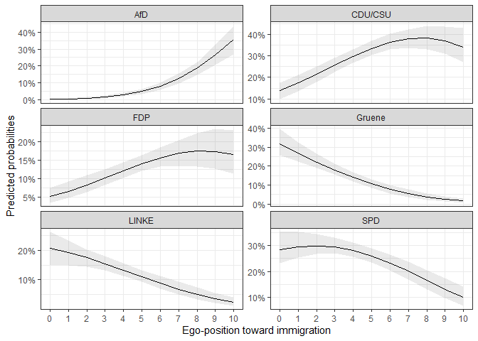
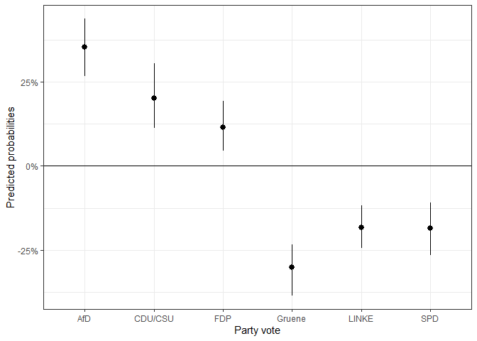
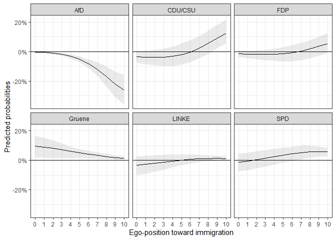

<!-- README.md is generated from README.Rmd. Please edit that file -->

# MNLpred - Simulated Predictions From Multinomial Logistic Models

<!-- badges: start -->

[](https://perso.crans.org/besson/LICENSE.html)
[](https://cran.r-project.org/package=MNLpred)
[](https://doi.org/10.5281/zenodo.4525343)
[](https://www.r-pkg.org/badges/version/MNLpred)
[](https://www.r-pkg.org/badges/version/MNLpred)
[](https://github.com/ManuelNeumann/MNLpred/actions)
<!-- badges: end -->

This package provides functions that make it easy to get plottable
predictions from multinomial logit models. The predictions are based on
simulated draws of regression estimates from their respective sampling
distribution.

At first I will present the theoretical and statistical background,
before using sample data to demonstrate the functions of the package.

## The multinomial logit model

For the statistical and theoretical background of the multinomial logit
regression please refer to the vignette or sources like [these lecture
notes by Germán
Rodríguez](https://data.princeton.edu/wws509/notes/c6s2).

Due to the inconvenience of integrating math equations in the README
file, this is not the place to write comprehensively about it.

These are the important characteristics of the model:

-   The multinomial logit regression is used to model nominal outcomes.
    It provides the opportunity to assign specific choices a
    probability, based on a set of independent variables.
-   The model needs an assigned baseline category to be identifiable.
    All other choices are evaluated in contrast to this reference.
-   The model returns a set of coefficients for each choice category.
-   Like all logit models, the multinomial logit model returns log-odds
    which are difficult to interpret in terms of effect sizes and
    uncertainties.

This package helps to interpret the model in meaningful ways.

## Using the package

### Installing

The package can be both installed from CRAN or the github repository:

``` r
# Uncomment if necessary:

# install.packages("MNLpred")
# devtools::install_github("ManuelNeumann/MNLpred")
```

### How does the function work?

As we have seen above, the multinomial logit can be used to get an
insight into the probabilities to choose one option out of a set of
alternatives. We have also seen that we need a baseline category to
identify the model. This is mathematically necessary, but does not come
in handy for purposes of interpretation.

It is far more helpful and easier to understand to come up with
predicted probabilities and first differences for values of interest
(see e.g., King, Tomz, and Wittenberg 2000 for approaches in social
sciences). Based on simulations, this package helps to easily predict
probabilities and their uncertainty in forms of confidence intervals for
each choice category over a specified scenario. The functions use the
observed values to compute the predicted probabilities, as is
recommended by Hanmer and Ozan Kalkan (2013).

The procedure follows the following steps:

1.  Estimate a multinomial model and save the coefficients and the
    variance covariance matrix (based on the Hessian-matrix of the
    model).
2.  To simulate uncertainty, make n draws of coefficients from a
    simulated sampling distribution based on the coefficients and the
    variance covariance matrix.
3.  Predict probabilities by multiplying the drawn coefficients with a
    specified scenario (the observed values).
4.  Take the mean and the quantiles of the simulated predicted
    probabilities.

The presented functions follow these steps. Additionally, they use the
so called observed value approach. This means that the “scenario” uses
all observed values that informed the model. Therefore the function
takes these more detailed steps:

1.  For all (complete) cases n predictions are computed based on their
    observed independent values and the n sets of coefficients.
2.  Next, the predicted values of all observations for each simulation
    are averaged.
3.  Take the mean and the quantiles of the simulated predicted
    probabilities (same as above).

For first differences, the simulated predictions are subtracted from
each other.

To showcase these steps, I present a reproducible example of how the
functions can be used.

### Example

The example uses data from the German Longitudinal Election Study (GLES,
Roßteutscher et al. (2019)).

The contains 1,000 respondents characteristics and their vote choice.

For this task, we need the following packages:

``` r
# Required packages
library(magrittr) # for pipes
library(nnet) # for the multinom()-function
library(MASS) # for the multivariate normal distribution

# The package
library(MNLpred)

# Plotting the predicted probabilities:
library(ggplot2)
library(scales)
```

Now we load the data:

``` r
# The data:
data("gles")
```

The next step is to compute the actual model. The function of the
`MNLpred` package is based on models that were estimated with the
`multinom()`-function of the `nnet` package. The `multinom()` function
is convenient because it does not need transformed datasets. The syntax
is very easy and resembles the ordinary regression functions. Important
is that the Hessian matrix is returned with `Hess = TRUE`. The matrix is
needed to simulate the sampling distribution.

As we have seen above, we need a baseline or reference category for the
model to work. Therefore, be aware what your baseline category is. If
you use a dependent variable that is of type `character`, the categories
will be ordered in alphabetical order. If you have a `factor`at hand,
you can define your baseline category, for example with the
`relevel()`function.

Now, let’s estimate the model:

``` r
# Multinomial logit model:
mod1 <- multinom(vote ~ egoposition_immigration + 
                   political_interest + 
                   income + gender + ostwest, 
                 data = gles,
                 Hess = TRUE)
#> # weights:  42 (30 variable)
#> initial  value 1791.759469 
#> iter  10 value 1644.501289
#> iter  20 value 1553.803188
#> iter  30 value 1538.792079
#> final  value 1537.906674 
#> converged
```

The results show the coefficients and standard errors. As we can see,
there are five sets of coefficients. They describe the relationship
between the reference category (`AfD`) and the vote choices for the
parties `CDU/CSU`, `FDP`, `Gruene`, `LINKE`, and `SPD`.

``` r
summary(mod1)
#> Call:
#> multinom(formula = vote ~ egoposition_immigration + political_interest + 
#>     income + gender + ostwest, data = gles, Hess = TRUE)
#> 
#> Coefficients:
#>         (Intercept) egoposition_immigration political_interest      income
#> CDU/CSU    3.101201              -0.4419104        -0.29177070  0.33114348
#> FDP        2.070618              -0.4106626        -0.19044703  0.18496691
#> Gruene     3.232074              -0.8482213        -0.03023454  0.24330589
#> LINKE      4.990008              -0.7477359        -0.04503371 -0.24206850
#> SPD        3.799394              -0.6425427        -0.03514426  0.08211066
#>           gender     ostwest
#> CDU/CSU 1.296949  0.79760035
#> FDP     1.252112  1.01378955
#> Gruene  1.831714  0.76299897
#> LINKE   1.368591 -0.02428322
#> SPD     1.497019  0.74026388
#> 
#> Std. Errors:
#>         (Intercept) egoposition_immigration political_interest    income
#> CDU/CSU   0.8568928              0.06504100          0.1694270 0.1872533
#> FDP       0.9508589              0.07083385          0.1882974 0.2063590
#> Gruene    0.9854950              0.07887427          0.1969704 0.2149368
#> LINKE     0.9505656              0.07755359          0.1962954 0.2058036
#> SPD       0.8880256              0.06912678          0.1779570 0.1924002
#>            gender   ostwest
#> CDU/CSU 0.3530225 0.3120178
#> FDP     0.3794295 0.3615071
#> Gruene  0.3875116 0.3671397
#> LINKE   0.3885663 0.3493941
#> SPD     0.3625652 0.3269007
#> 
#> Residual Deviance: 3075.813 
#> AIC: 3135.813
```

A first rough review of the coefficients shows that a more restrictive
ego-position toward immigration leads to a lower probability of the
voters to choose any other party than the AfD. It is hard to evaluate
whether the effect is statistically significant and how the
probabilities for each choice look like. For this it is helpful to
predict the probabilities for certain scenarios and plot the means and
confidence intervals for visual analysis.

Let’s say we are interested in the relationship between the ego-position
toward immigration and the probability to choose any of the parties. It
would be helpful to plot the predicted probabilities for the span of the
positions.

``` r
summary(gles$egoposition_immigration)
#>    Min. 1st Qu.  Median    Mean 3rd Qu.    Max. 
#>   0.000   3.000   4.000   4.361   6.000  10.000
```

As we can see, the ego positions were recorded on a scale from 0 to 10.
Higher numbers represent more restrictive positions. We pick this score
as the x-variable (`x`) and use the `mnl_pred_ova()` function to get
predicted probabilities for each position in this range.

The function needs a multinomial logit model (`model`), data (`data`),
the variable of interest `x`, the steps for which the probabilities
should be predicted (`by`). Additionally, a `seed` can be defined for
replication purposes, the numbers of simulations can be defined
(`nsim`), and the confidence intervals (`probs`).

If we want to hold another variable stable, we can specify so with
`z`and `z_value`. See also the `mnl_fd_ova()` function below.

``` r
pred1 <- mnl_pred_ova(model = mod1,
                      data = gles,
                      x = "egoposition_immigration",
                      by = 1,
                      seed = 68159,
                      nsim = 100, # faster
                      probs = c(0.025, 0.975)) # default
#> Multiplying values with simulated estimates:
#> ================================================================================
#> Applying link function:
#> ================================================================================
#> Done!
```

The function returns a list with several elements. Most importantly, it
returns a `plotdata` data set:

``` r
pred1$plotdata %>% head()
#>   egoposition_immigration vote        mean       lower       upper
#> 1                       0  AfD 0.002419192 0.001025942 0.004913258
#> 2                       1  AfD 0.004625108 0.002172854 0.008685788
#> 3                       2  AfD 0.008653845 0.004472502 0.014698651
#> 4                       3  AfD 0.015796304 0.008923480 0.025148142
#> 5                       4  AfD 0.028022769 0.017756232 0.040861062
#> 6                       5  AfD 0.048081830 0.033241425 0.063794110
```

As we can see, it includes the range of the x variable, a mean, a lower,
and an upper bound of the confidence interval. Concerning the choice
category, the data is in a long format. This makes it easy to plot it
with the `ggplot` syntax. The choice category can now easily be used to
differentiate the lines in the plot by using `linetype = vote` in the
`aes()`. Another option is to use `facet_wrap()` or `facet_grid()` to
differentiate the predictions:

``` r
ggplot(data = pred1$plotdata, aes(x = egoposition_immigration, 
                                  y = mean,
                                  ymin = lower, ymax = upper)) +
  geom_ribbon(alpha = 0.1) + # Confidence intervals
  geom_line() + # Mean
  facet_wrap(.~ vote, scales = "free_y", ncol = 2) +
  scale_y_continuous(labels = percent_format(accuracy = 1)) + # % labels
  scale_x_continuous(breaks = c(0:10)) +
  theme_bw() +
  labs(y = "Predicted probabilities",
       x = "Ego-position toward immigration") # Always label your axes ;)
```

<!-- -->

If we want first differences between two scenarios, we can use the
function `mnl_fd2_ova()`. The function takes similar arguments as the
function above, but now the values for the scenarios of interest have to
be supplied. Imagine we want to know what difference it makes to
position oneself on the most tolerant or most restrictive end of the
`egoposition_immigration` scale. This can be done as follows:

``` r
fdif1 <- mnl_fd2_ova(model = mod1,
                     data = gles,
                     x = "egoposition_immigration",
                     value1 = min(gles$egoposition_immigration),
                     value2 = max(gles$egoposition_immigration),
                     seed = 68159,
                     nsim = 100)
#> Multiplying values with simulated estimates:
#> ================================================================================
#> Applying link function:
#> ================================================================================
#> Done!
```

The first differences can then be depicted in a graph.

``` r
ggplot(fdif1$plotdata_fd, aes(x = categories, 
                              y = mean,
                              ymin = lower, ymax = upper)) +
  geom_pointrange() +
  geom_hline(yintercept = 0) +
  scale_y_continuous(labels = percent_format()) +
  theme_bw() +
  labs(y = "Predicted probabilities",
       x = "Party vote")
```

<!-- -->

We are often not only interested in the static difference, but the
difference across a span of values, given a difference in a second
variable. This is especially helpful when we look at dummy variables.
For example, we could be interested in the effect of `gender` on the
vote decision over the different ego-positions. With the `mnl_fd_ova()`
function, we can predict the probabilities for two scenarios and
subtract them. The function returns the differences and the confidence
intervals of the differences. The different scenarios can be held stable
with `z` and the `z_values`. `z_values` takes a vector of two numeric
values. These values are held stable for the variable that is named in
`z`.

``` r
fdif2 <- mnl_fd_ova(model = mod1,
                    data = gles,
                    x = "egoposition_immigration",
                    by = 1,
                    z = "gender",
                    z_values = c(0,1),
                    seed = 68159,
                    nsim = 100)
#> First scenario:
#> Multiplying values with simulated estimates:
#> ================================================================================
#> Applying link function:
#> ================================================================================
#> Done!
#> 
#> Second scenario:
#> Multiplying values with simulated estimates:
#> ================================================================================
#> Applying link function:
#> ================================================================================
#> Done!
```

As before, the function returns a list including a data set that can be
used to plot the differences.

``` r
fdif2$plotdata_fd %>% head()
#>   egoposition_immigration vote         mean        lower        upper
#> 1                       0  AfD -0.002861681 -0.006172786 -0.001206796
#> 2                       1  AfD -0.005396410 -0.010531302 -0.002537904
#> 3                       2  AfD -0.009942124 -0.017921934 -0.005038667
#> 4                       3  AfD -0.017827751 -0.029548569 -0.009657235
#> 5                       4  AfD -0.030957366 -0.046960384 -0.017810853
#> 6                       5  AfD -0.051691516 -0.071903589 -0.031438906
```

Since the function calls the `mnl_pred_ova()` function internally, it
also returns the output of the two predictions in the list element
`Prediction1` and `Prediction2`. The plot data for the predictions is
already bound together row wise to easily plot the predicted
probabilities.

``` r
ggplot(data = fdif2$plotdata, aes(x = egoposition_immigration, 
                                  y = mean,
                                  ymin = lower, ymax = upper,
                                  group = as.factor(gender),
                                  linetype = as.factor(gender))) +
  geom_ribbon(alpha = 0.1) +
  geom_line() +
  facet_wrap(. ~ vote, scales = "free_y", ncol = 2) +
  scale_y_continuous(labels = percent_format(accuracy = 1)) + # % labels
  scale_x_continuous(breaks = c(0:10)) +
  scale_linetype_discrete(name = "Gender",
                          breaks = c(0, 1),
                          labels = c("Male", "Female")) +
  theme_bw() +
  labs(y = "Predicted probabilities",
       x = "Ego-position toward immigration") # Always label your axes ;)
```

<!-- -->

As we can see, the differences between `female` and `male` differ,
depending on the party and ego-position. So let’s take a look at the
differences:

``` r
ggplot(data = fdif2$plotdata_fd, aes(x = egoposition_immigration, 
                                     y = mean,
                                  ymin = lower, ymax = upper)) +
  geom_ribbon(alpha = 0.1) +
  geom_line() +
  geom_hline(yintercept = 0) +
  facet_wrap(. ~ vote, ncol = 3) +
  scale_y_continuous(labels = percent_format(accuracy = 1)) + # % labels
  scale_x_continuous(breaks = c(0:10)) +
  theme_bw() +
  labs(y = "Predicted probabilities",
       x = "Ego-position toward immigration") # Always label your axes ;)
```

<!-- -->

We can see that the differences are for some parties at no point
statistically significant from 0.

## Conclusion

Multinomial logit models are important to model nominal choices. They
are, however, restricted by being in need of a baseline category.
Additionally, the log-character of the estimates makes it difficult to
interpret them in meaningful ways. Predicting probabilities for all
choices for scenarios, based on the observed data provides much more
insight. The functions of this package provide easy to use functions
that return data that can be used to plot predicted probabilities. The
function uses a model from the `multinom()` function and uses the
observed value approach and a supplied scenario to predict values over
the range of fitting values. The functions simulate sampling
distributions and therefore provide meaningful confidence intervals.
`mnl_pred_ova()` can be used to predict probabilities for a certain
scenario. `mnl_fd_ova()` can be used to predict probabilities for two
scenarios and their first differences.

## Acknowledgment

My code is inspired by the method courses in the [Political Science
master’s program at the University of
Mannheim](https://www.sowi.uni-mannheim.de/en/academics/prospective-students/ma-in-political-science/)(cool
place, check it out!). The skeleton of the code is based on a tutorial
taught by [Marcel Neunhoeffer](https://www.marcel-neunhoeffer.com/)
(lecture: “Advanced Quantitative Methods” by [Thomas
Gschwend](https://www.sowi.uni-mannheim.de/gschwend/)).

## References

<div id="refs" class="references csl-bib-body hanging-indent">

<div id="ref-hanmer2013" class="csl-entry">

Hanmer, Michael J., and Kerem Ozan Kalkan. 2013. “Behind the Curve:
Clarifying the Best Approach to Calculating Predicted Probabilities and
Marginal Effects from Limited Dependent Variable Models.” *American
Journal of Political Science* 57 (1): 263–77.
<https://doi.org/10.1111/j.1540-5907.2012.00602.x>.

</div>

<div id="ref-king2000" class="csl-entry">

King, Gary, Michael Tomz, and Jason Wittenberg. 2000. “Making the Most
of Statistical Analyses: Improving Interpretation and Presentation.”
*American Journal of Political Science* 44 (2): 341–55.
<https://doi.org/10.2307/2669316>.

</div>

<div id="ref-rosteutscher2019" class="csl-entry">

Roßteutscher, Sigrid, Harald Schoen, Rüdiger Schmitt-Beck, Christof
Wolf, and Alexander Staudt. 2019. “Rolling Cross-Section-Wahlkampfstudie
Mit Nachwahl-Panelwelle (GLES 2017).” GESIS Datenarchiv.
<https://doi.org/10.4232/1.13213>.

</div>

</div>
